# Full-Stack-Restaurant-Project

This is a full stack development project with HTML5 and CSS3 on front-end. In the back-end I have used MVC and Stored Procedure.

I took inspiration from Colorib Meal Restaurant template to make front-end of this project: https://colorlib.com/wp/template/meal/

I used boxicons icons in the Contact us section: https://boxicons.com/

I downloaded images from: https://www.wallpaperflare.com/ and https://wallpapercave.com/

# Screenshots

# HOME

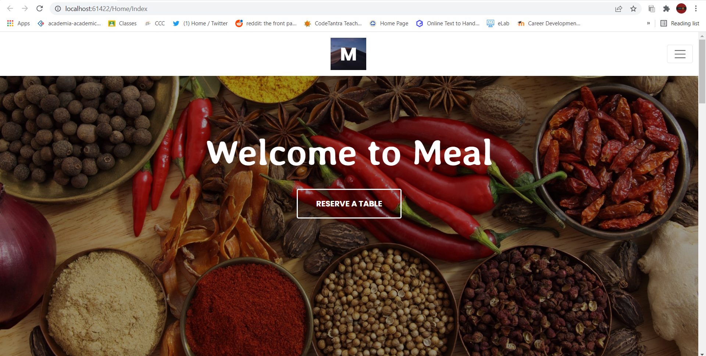

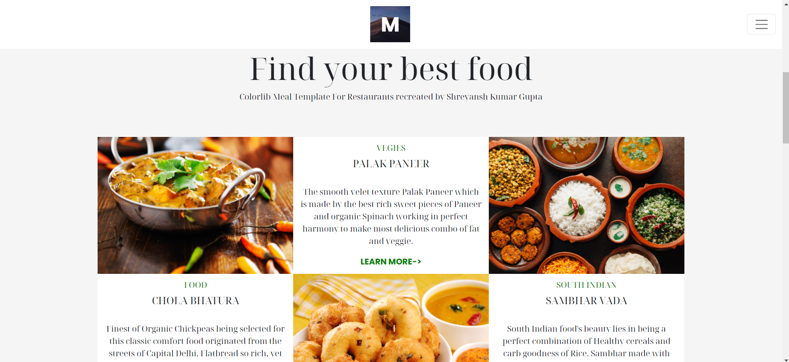

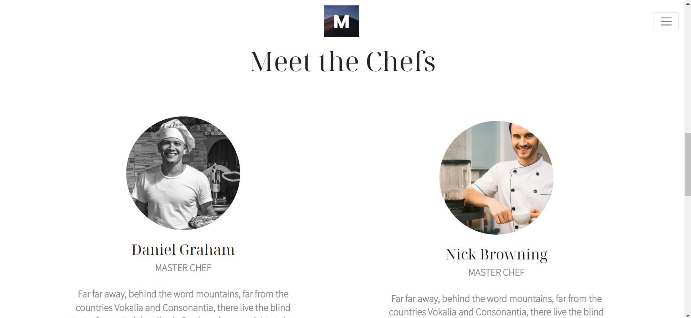

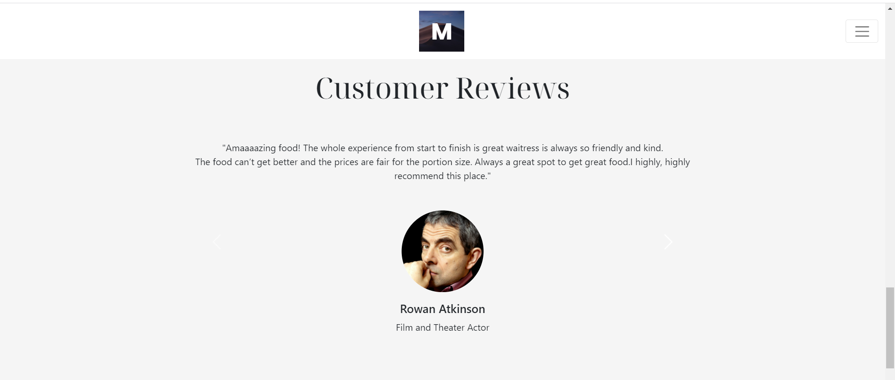

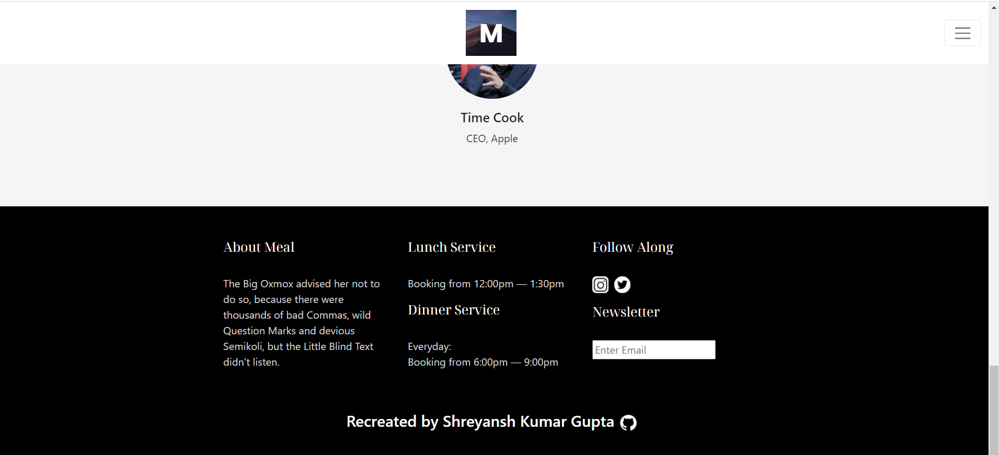

# ABOUT

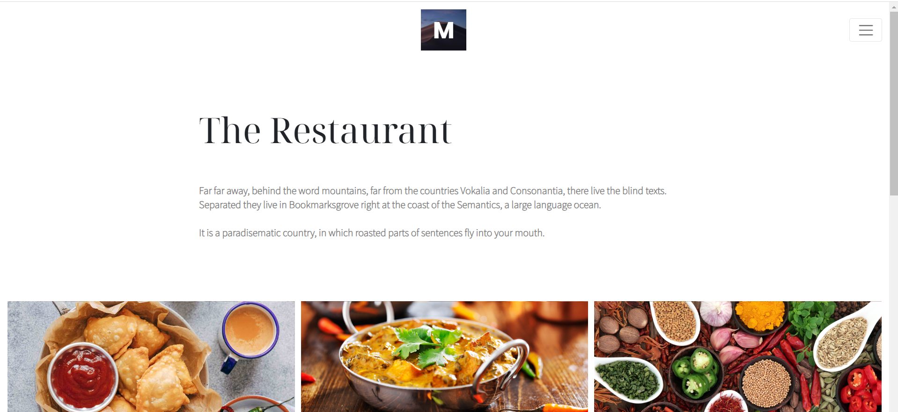

# MENU

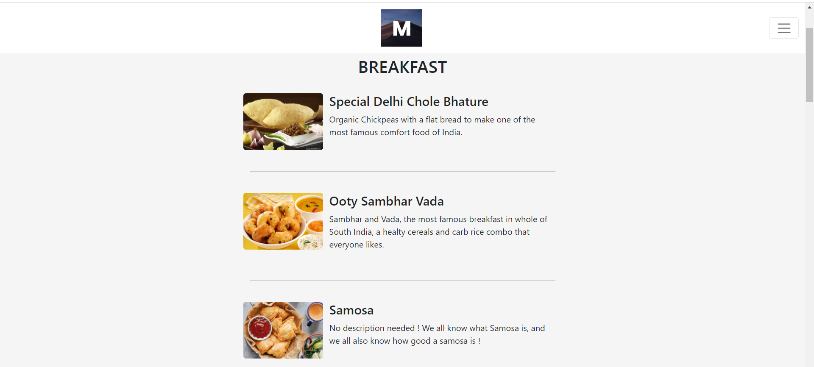

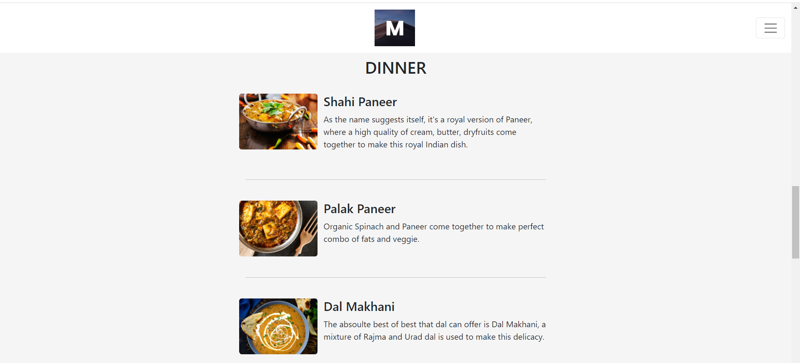

# CONTACT US

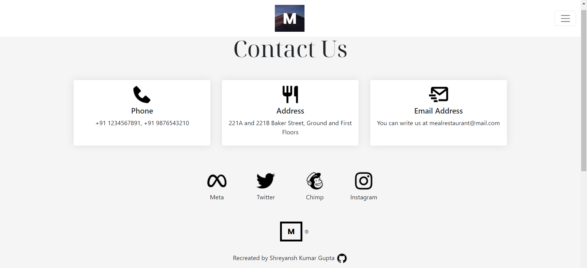

# TABLE REVERSE

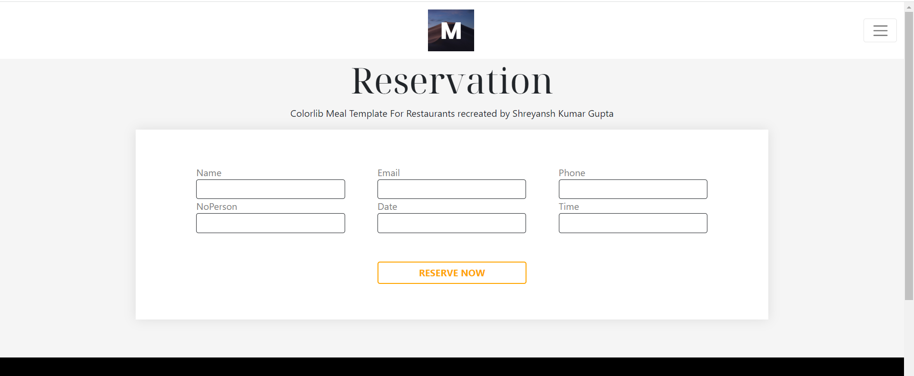

# DATABASE

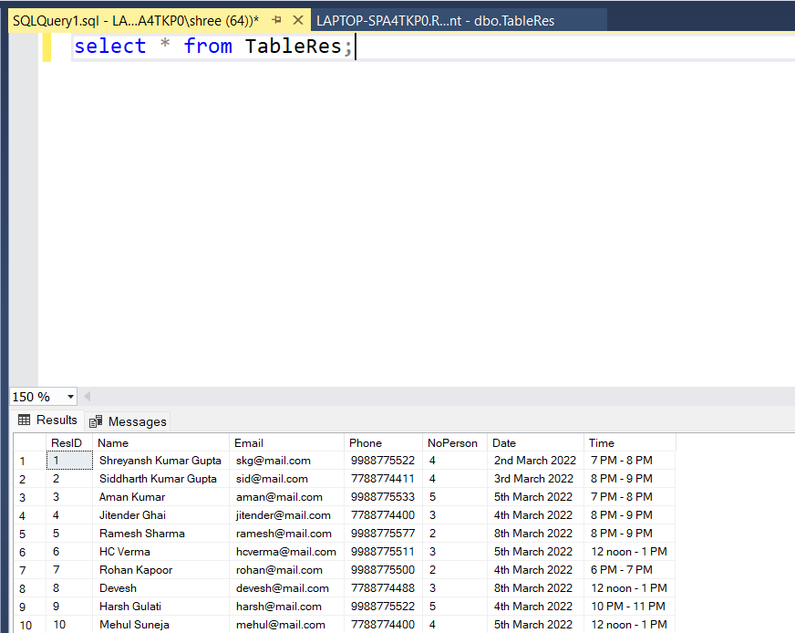

